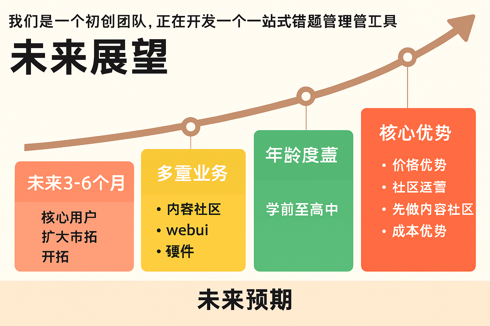

***建议将项目设置为privat***


使用曲线样式

- 市场前景3-6个月（纵向、横向；业务/年龄段覆盖）

- 核心优势（参 未来展望-对比[学而思](https://www.wolai.com/5dDrFgJ9gukFxDbT3hAejC)）

  ```
  堆砌功能,效果不好—纯属靠公司名声+宣传,一台机器卖6000
  
  内容生态封闭,技术落后,
  
  大公司病,没有办法打造社区化,靠社区宣传,而是把成本花在宣发上,毛利率很低
  
  我们可以通过价格战取胜
  
  我们靠北师大口碑+北师大在教育领域的合作积淀+团队背景,在社区运营构建上天生有优势,我们可以做教育领域的小红书
  
  我们的思路是先做内容社区+webui,内容社区做起来再做硬件
  
  （点点AI-小红书：AI內容生态->吸引用户，传导产生价格优势）
  ```

  

### [未来展望](https://www.wolai.com/fyFH9muTt8CTRRjXFdEZ8B)


### [未来展望-松鼠AI](https://www.wolai.com/tVUMyxku5RbnA4rCsw4BQK)

（市场潜力）


失败的尝试（感觉远没有production ready）

